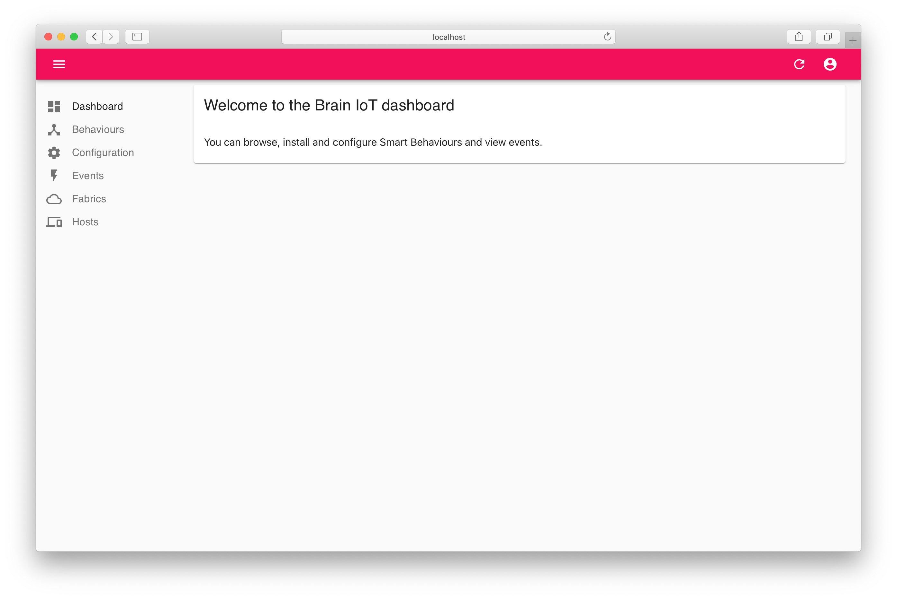
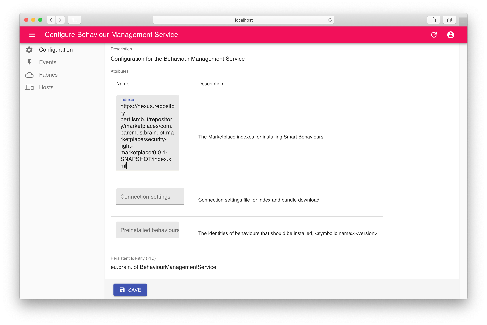
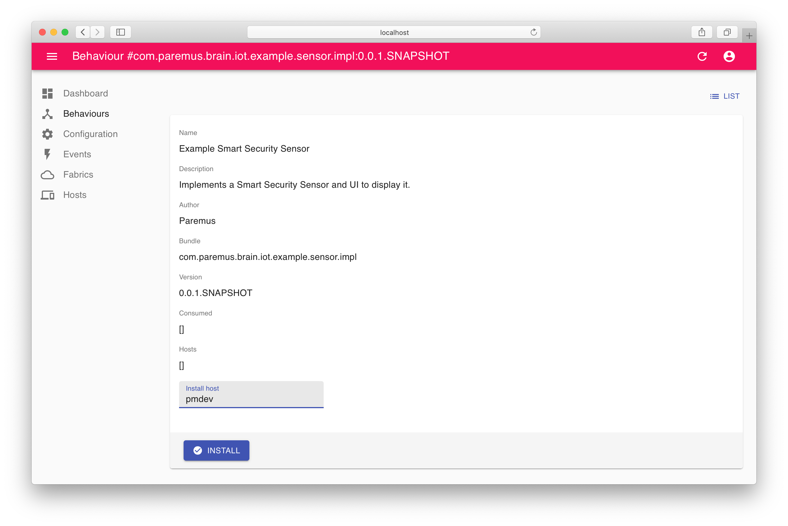
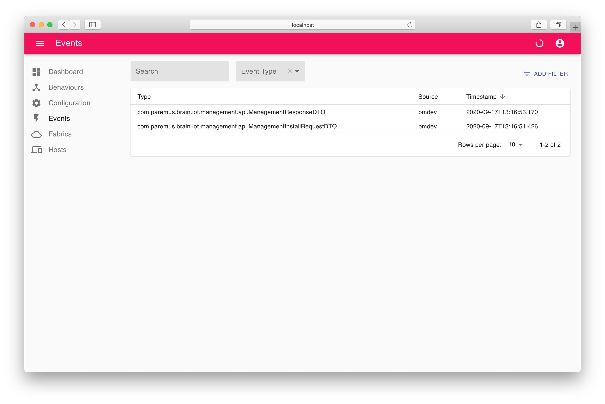
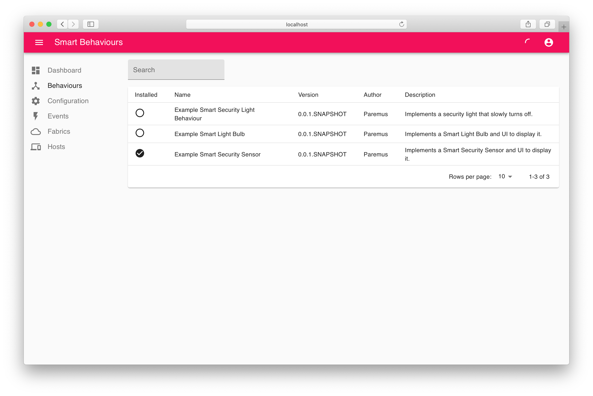
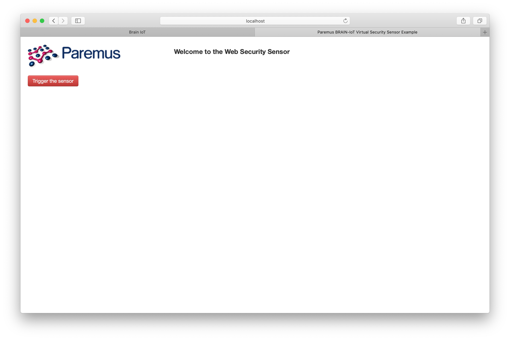
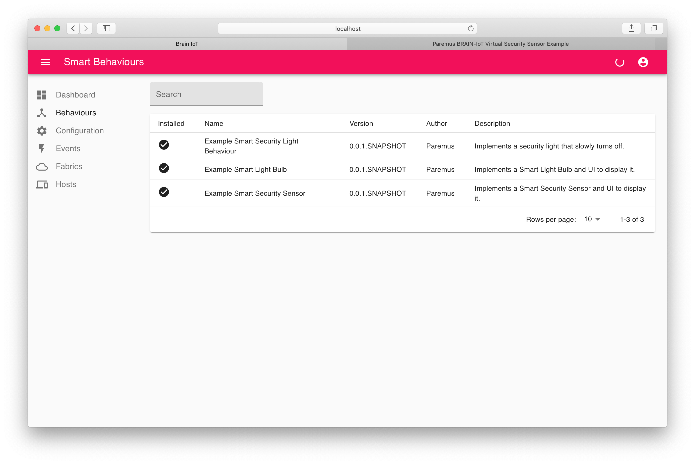
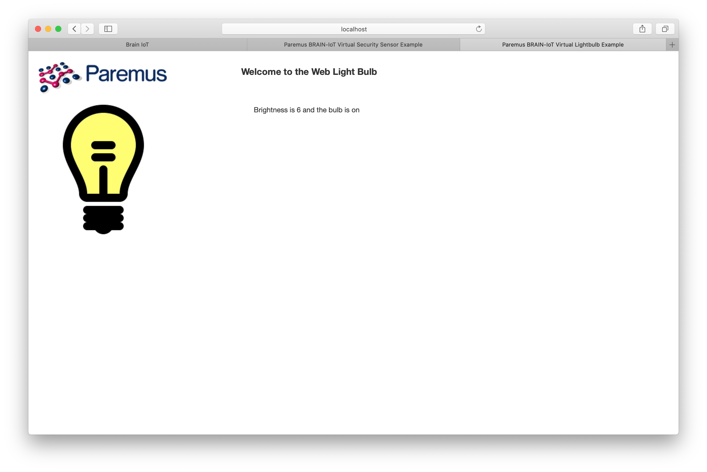

## Summary 

In this tutorial we'll first run the BRAIN-IoT core services in a single container, and then use the BRAIN-IoT UI to install and run the Security Light Example, which contains 3 Smart Behaviours.

BRAIN-IoT uses a distributed archtecture, but it's much faster to deploy it in a single container first. The [Distributed Deployment](20-distributed.html) tutorial covers deploying a distributed BRAIN-IoT system.
{:.note}

## Run Core Services

We start by first downloading and then running the core BRAIN-IoT services in a single container . This will also confirm that your local environment meets the required [prerequisites](00-prerequisites.html#required-tools).

### Download

The `admin-user-interface` git repository contains a useful `app.test` that runs a whole BRAIN-IoT system in a single container.

Clone the [admin-user-interface](https://git.repository-pert.ismb.it/BRAIN-IoT/admin-user-interface){:target="_blank"} from GitLab and change directory into `admin-user-interface`.

    ~ $ git clone git@git.repository-pert.ismb.it:BRAIN-IoT/admin-user-interface.git
    ~ $ cd admin-user-interface
{: .shell }

### Build

Build  with the following command:

    ~/admin-user-interface $ mvn install
{: .shell }

### Run

`app.test/app.bndrun` defines an application containing the BRAIN-IoT core services and UI.

<a class="btn btn-primary" data-toggle="collapse" href="#bndrun" aria-expanded="false" aria-controls="app.bndrun">app.bndrun</a>

  





It can be started with the `bnd run` command:

    ~/admin-user-interface $ bnd run app.test/app.bndrun
    [INFO] Started Jetty 9.4.15.v20190215 at port(s) HTTP:8081 on context path / [minThreads=8,maxThreads=200,acceptors=1,selectors=4]
{: .shell }

The console will contain more output than shown above.
When you want to terminate the application press **Ctrl+C**.
{:.note}

## Explore BRAIN-IoT UI

Browse to  <http://localhost:8081>{:target="_blank"}, where you should see the BRAIN-IoT UI. Login with username `admin` and password `admin`:

{: height="400px"}

### Configure marketplace

Click on the `Events` tab and you'll see that no events are found.

Click on the `Behaviours` tab and you'll see that no behaviours are found.

This is because the Behaviour Management Service (BMS) has not been configured with any marketplace artifacts. So we'll configure it with the marketplace for the Security Light Example, which is deployed in Nexus.

Click on the `Configuration` tab and then `Behaviour Management Service` then copy the [security light marketplace](https://nexus.repository-pert.ismb.it/repository/marketplaces/com.paremus.brain.iot.marketplace/security-light-marketplace/0.0.1-SNAPSHOT/index.xml) URL into the `Indexes` field and save the configuration:

{: height="400px"}

Click on the `Behaviours` tab again and you'll now see the Security Light Example behaviours:.

{: height="400px"}

### Install Smart Behaviour

Click on the `Example Smart Security Sensor` and  then click in the `Install host` field. Select the only host and click `INSTALL`:

{: height="400px"}

Click on the `Events` tab and you should see two events for installation:

{: height="400px"}

Now click back to the `Behaviours` tab and you'll see the Example Security Sensor is installed:

{: height="400px"}

## Security Light Example

We're now ready to run through the Security Light Example.

It consists of a `sensor`,  a `light` and a `controller`, all implemented as BRAIN-IoT Smart Behaviours. The `sensor` and `light` are 'virtual' and implemented as web pages.

When the sensor is activated it sends an event to the controller. The controller then sends a series of events to the light which cause it to switch on brightly and then slowly dim.

We have currently only installed the `sensor`.

We will show that when the sensor is activated, the BMS will detect the unhandled event for the `controller` and automatically install the appropriate behaviour from the marketplace.

Similarly, when the `controller` sends an event to the `light`, the BMS will automatically install the `light` behaviour from the marketplace.

### Trigger Example Sensor

So let's get started!

Browse to  <http://localhost:8081/example/sensor-ui/index.html>{:target="_blank"}, where you should see the Example Sensor webpage:

{: height="400px"}

Click `Trigger the sensor`. 

Switch back to the main BRAIN-IoT UI and click the `Behaviours` tab. You should see that all behaviours are now installed (you may need to refresh page):

{: height="400px"}

### Observe Example Light bulb

Browse to  <http://localhost:8081/example/light-ui/index.html>{:target="_blank"}, where you should see the Example Light Bulb webpage:

{: height="400px"}

If you missed it being lit up, then just click `Trigger the sensor` again and then switch back to the `light` webpage.

### Observe Events

Now  switch back to the main BRAIN-IoT UI and click the `Events` tab. You should see lots of events, specifically `SensorReadingDTO` which is sent from the `sensor` and `LightCommand` which is sent from the `controller`:

{: height="400px"}

## End
That completes this tutorial.

To terminate the application press **Ctrl+C** in the terminal window.

