## Summary

In this tutorial we'll deploy the BRAIN-IoT core services in multiple containers using the Paremus Service Fabric.

The Fabric manages multiple remote containers  and can deploy OSGi artifacts to them.

This tutorial assumes a Fabric is already running and we know its admin URL. 
The [Create Fabric in Cloud](30-fabric-cloud.html) and  [Create Fabric on-premise](35-fabric-onpremise.html) tutorials cover creating and starting a Fabric.
{:.note}

## Setup

An HTTP server is required to serve the BRAIN-IoT artefacts to be deployed to the Fabric.

### brain-iot-repos

We first need to copy the BRAIN-IoT core repositories to the HTTP server. These contain the Event Bus, Behaviour Management Service, BRAIN-IoT User Interface and their dependencies.

You can either clone and build the [fabric-deployment](https://git.repository-pert.ismb.it/BRAIN-IoT/fabric-deployment){:target="_blank"} project from GitLab or download the latest [brain-iot-repos.zip](https://nexus.repository-pert.ismb.it/repository/maven-snapshots/com/paremus/brain/iot/brain-iot-repos/0.0.1-SNAPSHOT/brain-iot-repos-0.0.1-20200720.125205-11.zip) from Nexus.

If you chose to build the `fabric-deployment` project, the zip is located in

```
fabric-deploy-repos/brain-iot-repos/target/brain-iot-repos-0.0.1-SNAPSHOT.zip
```

Unzip `brain-iot-repos.zip` in the root of the HTTP server (it unpacks to `brain-iot-repos`), for example:

    webserver $ cd /var/www/html
    webserver $ unzip /tmp/brain-iot-repos-0.0.1-SNAPSHOT.zip
    webserver $ ls brain-iot-repos
    core ui
{:.shell}

### System Document

The Fabric uses a `system document` to control deployment. Its purpose is similar to the `app.bndrun` from the `quickstart` tutorial.

A `system document` defines multiple `system.part`, each of which is deployed to an isolated OSGi framework in a remote OSGi container (or "fibre").

The key parts of a system document are:

#### repopath

`repopath`: is a list of relative or absolute URLs to repository indexes.

It is similar to the `-standalone: target/index.xml` directive in `bndrun`.

```xml
<system xmlns="http://schema.paremus.com/sf/1.2"
        name="Brain-IoT-Smart-Security-Light-Fabric"
        version="1.0.0"
        repopath="brain-iot-repos/core/index.xml,brain-iot-repos/ui/index.xml"
        boundary="fabric">
```

#### system.part

`system.part` contains all other elements:

```xml
 <system.part name="Core">
 ...
 </system.part>
 
 <system.part name="UI">
 ...
 </system.part>
```

#### config

`config` is used to configure `system.part` using ConfigAdmin.

Here is the config for the UI, note the setting of port=8888:

```xml
    <config pid="org.apache.felix.http" factory="true">
      <property name="org.osgi.service.http.port" value="8888" />
      <property name="org.eclipse.jetty.servlet.SessionCookie"
                value="Paremus-SessionId" />
    </config>
```

and here is the config to set the security light marketplace indexes on the Behaviour Management Service:

```xml
    <config pid="eu.brain.iot.BehaviourManagementService">
      <!-- brain-iot marketplace indexes (comma separated) -->
      <property name="indexes"
                value="https://nexus.repository-pert.ismb.it/repository/marketplaces/com.paremus.brain.iot.marketplace/security-light-marketplace/0.0.1-SNAPSHOT/index.xml" />
    </config>
```

Note this is the _only_ part of the `system document` that is specific to the security light. If we omit this setting, the `system document` would be generic and we could configure the marketplace indexes in the UI.
{:.note}

#### system.part.element

`system.part.element` is similar to `-runrequires` in `bndrun`:

```xml
    <!-- The core BRAIN-IoT fabric requirements -->
    <system.part.element name="com.paremus.brain.iot.eventing.impl"
                         category="osgi.bundle" />
```

#### replication.handler

A replication handler has no equivalent in `bndrun`. It is used to replicate a `system.part` across multiple remote containers:

```xml
    <!-- replicate Core system.part to all nodes -->
    <replication.handler name="scale" type="scalable">
      <property name="scaleFactor" value="1.0" type="float" />
      <property name="minimum" value="1" type="integer" />
    </replication.handler>
```

#### contract

`contract` is used to target deployment. Here the UI `system.part` will only be deployed to a node containing the `UI` feature:

```xml
    <!-- deploy to node with label UI -->
    <contract features="(UI=*)" cancelationCost="-1"/>
```

#### brain-iot-system.xml 

Here's the full `brain-iot-system.xml` for the Security Light. It needs to be installed at the root of the HTTP server (so that the `repopath` resolves to the `brain-iot-repos` we've just unpacked).

<p>
  <a class="btn btn-primary" data-toggle="collapse" href="#system" aria-expanded="false" aria-controls="system">
    brain-iot-system.xml
  </a>
</p>
<div class="collapse" id="system">
  <div class="card card-block">




</div>
</div>

You can either copy/paste it from here or clone the [fabric-systems](https://git.repository-pert.ismb.it/BRAIN-IoT/fabric-systems){:target="_blank"} project from GitLab (its path is `security-light-fabric/src/main/resources/brain-iot-system.xml`).

To confirm that setup is correct, browse to <http://10.8.0.98/brain-iot-system.xml>{:target="_blank"}, replacing 10.8.0.98 with the ip-address of your HTTP server.

## Deploy on Fabric

Now we've completed the setup we can deploy the Security Light Example to the Fabric.

### Fabric UI

Browse to the Admin URL for your Fabric, for example: <https://10.8.0.94:9106/>{:target="_blank"}

Note: the Fabric doesn't have a security certificate, so you'll need to dismiss browser warnings about it being an unsecure site.
{:.warning}

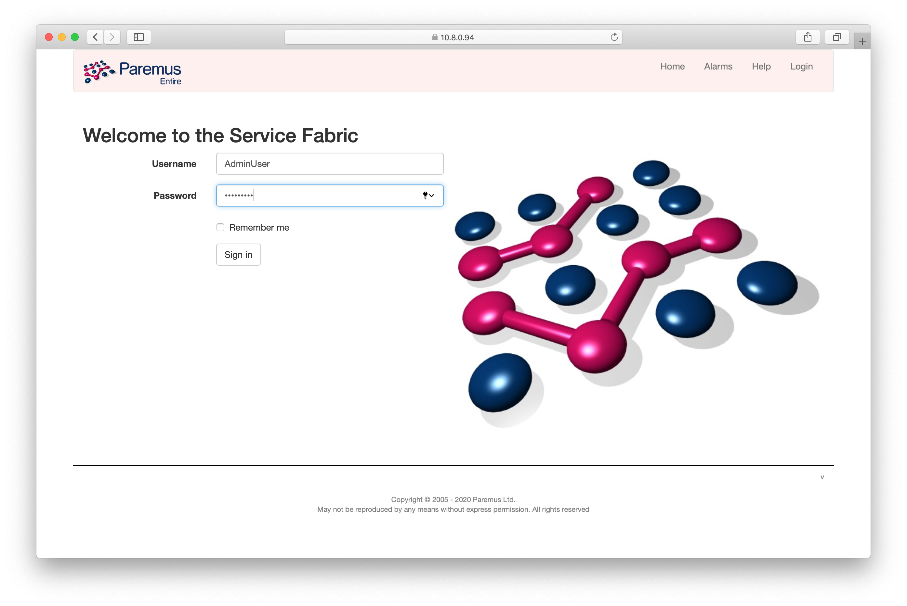{: height="400px"}

Login with username `AdminUser` and password `AdminUser`, and then click the checkbox to show `Fibre Names`:

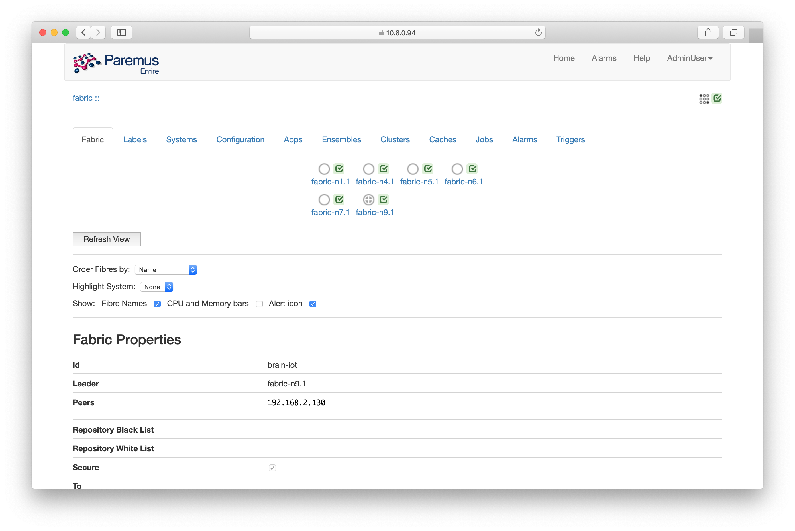{: height="400px"}

You should see one `fibre` icon for each node in your Fabric. In this case the node `fabric-n9` is the `infrastructure` node (indicated by the cross in its icon). The `infrastructure` node is responsible for downloading artifacts and deploying them to other nodes.

### Set Labels

Labels are used to control deployment. You may remember that the UI `system.part` was configured with a `contract` so it would only be deployed to a fibre with the `UI` feature.

Click on the `Labels` tab so see whether the `UI` label is already set.

Then click back to the `Fabric` tab, and click the node where you want the UI to be deployed. For example, the `infrastructure`node `fabric-n9`. 

Then enter "UI" for the name and "true" for the value, and click the `+` symbol:

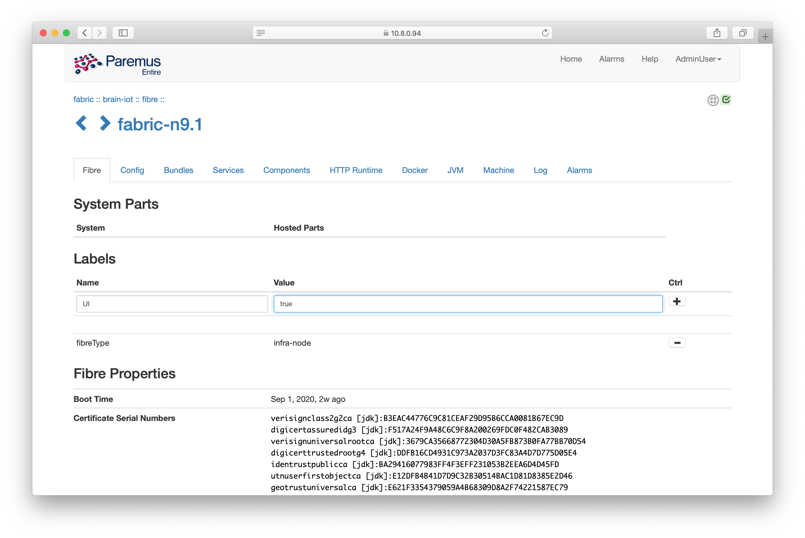{: height="400px"}

Now return to the main view by clicking the fabric name in the bread crumbs at the top left (its `:: brain-iot ::` in this example).

### Deploy System

Click the `Systems` tab, and then paste the URL of the Security Light `system document` we prepared earlier:

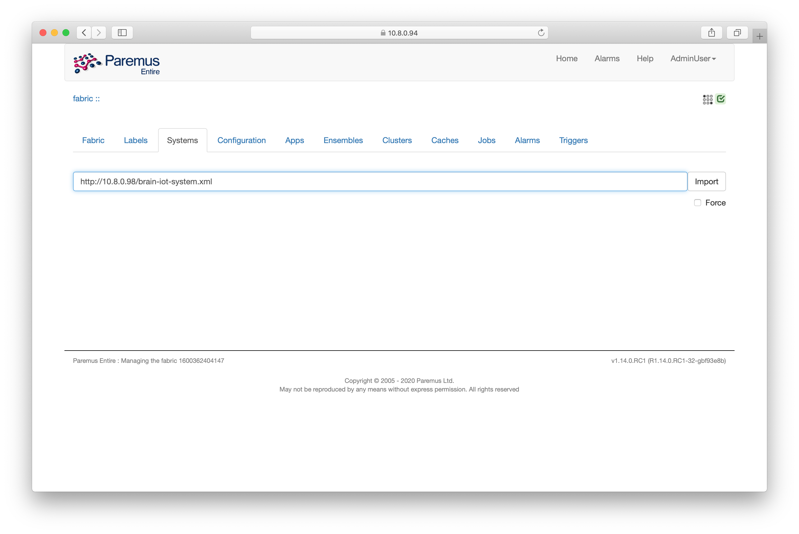{: height="400px"}

Then click the `Import` button, after a few seconds the system name should appear:

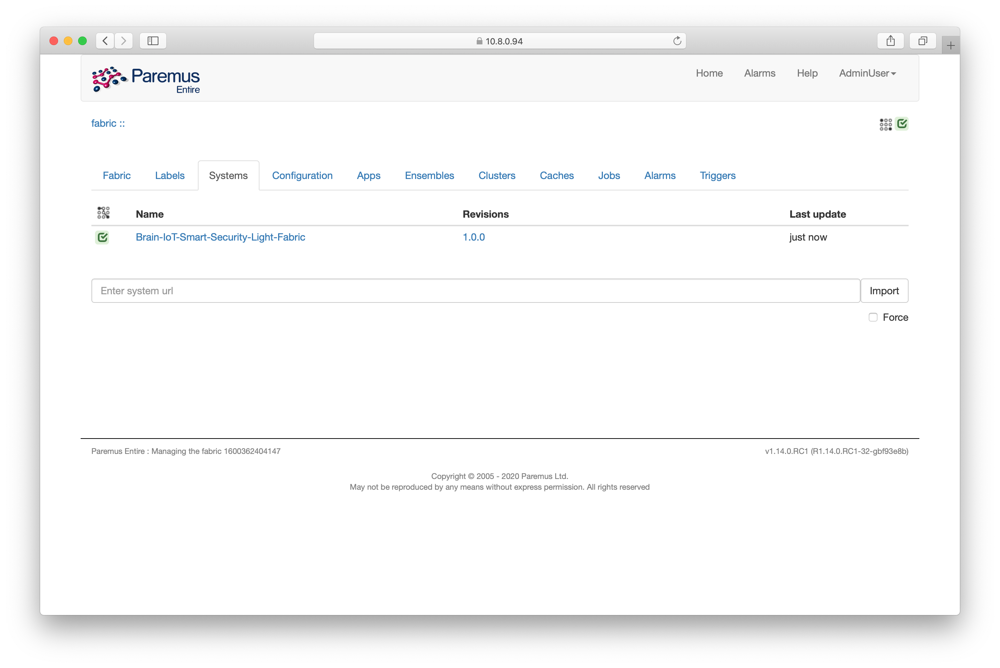{: height="400px"}

Now click the system name and you'll see the deployment page:

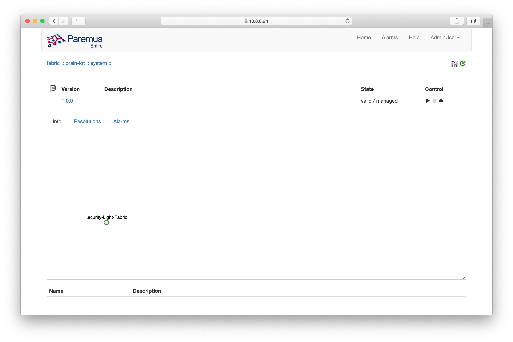{: height="400px"}

If the state is not `valid/managed` it means there was a problem resolving the bundles. See the [trouble shooting](35-fabric-onpremise.html#trouble-shooting) page for how to diagnose this issue.
{:.warning}

Click the `deploy` control (it looks like a play button). After a minute (or two) you should see the resolution of the deployment, showing the UI has been deployed to `fabric-n9` and the  BRAIN-IoT Core has been deployed to all other nodes:

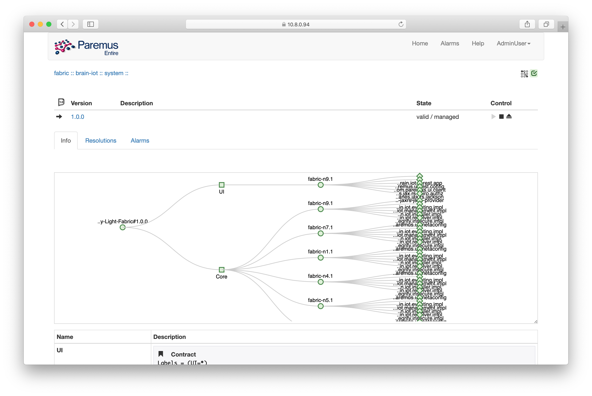{: height="400px"}

## BRAIN-IoT UI

Now that the system has been deployed, we should be able to access the BRAIN-IoT UI on port `8888` of `fabric-n9` <http://10.8.0.94:8888>{:target="_blank"}

Login with username `admin` and password `admin` as in the `quickstart` tutorial.

Now click on the `Hosts` tab, you should see all the nodes in the BRAIN-IoT Fabric:

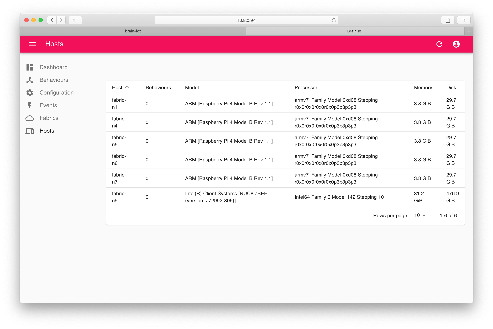{: height="400px"}

We didn't visit this page in the `quickstart` tutorial because there was only a single host.
{:.note}

Now click the `Behaviours` tab and you'll see the Security Light Behaviours are already there. This is because the `system document` configured the BMS with these indexes.

We will now install the Security Light Behaviours, each on a different node.

Click on `Example Smart Security Sensor` and then click in the `Install host` field (as we did in the `quickstart` tutorial), but now you can choose to install the behaviour on any host:

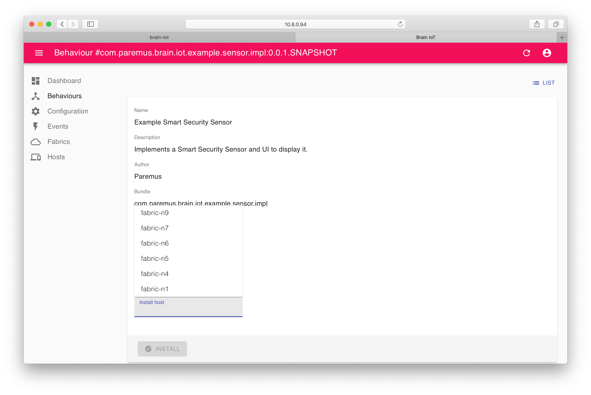{: height="400px"}

Choose any host and click `Install`, then repeat for the `Example Smart Light Bulb` and `Example Smart Security Light Behaviour` choosing a different host each time.

You may need to refresh the page or switch tabs to see the `Installed` icon change.
{:.note}

If you now click on the `Hosts` tab, you should see that 3 hosts have 1 behaviour installed:

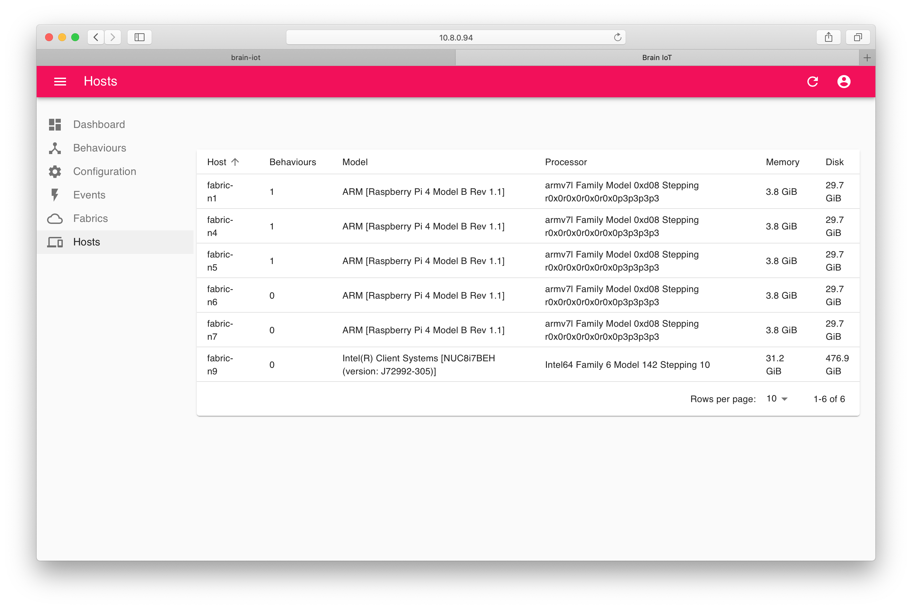{: height="400px"}

## Security Light Example

You can now run throught the Security Light Example (as we did in the `quickstart` tutorial), except now the `sensor` and `light` are on different hosts.

I installed the `sensor` to `fabric-n1` and the `light` to `fabric-n4`.

So the URL for the `sensor` is <http://10.8.0.22:9100/sensor-ui/index.html>{:target="_blank"}, and the URL for the `light` is  <http://10.8.0.66:9100/light-ui/index.html>{:target="_blank"}

Note that these URLs are _not_ prefixed by /example as they were in the `quickstart` tutorial and they use port 9100.
{:.note}

The example should work just as it did in the `quickstart` tutorial, except now the events are being delivered to remote nodes.

### Discover HTTP port

To see which port is used by the HTTP service for the example UIs, you need to look in Fabric Admin. Click the icon for the node, in this case `fabric-n1` and then click the `HTTP Runtime` tab. Click the `Framework` dropdown and select the `Core` framework.

The IP address and port are listed under `Serving Endpoint`:

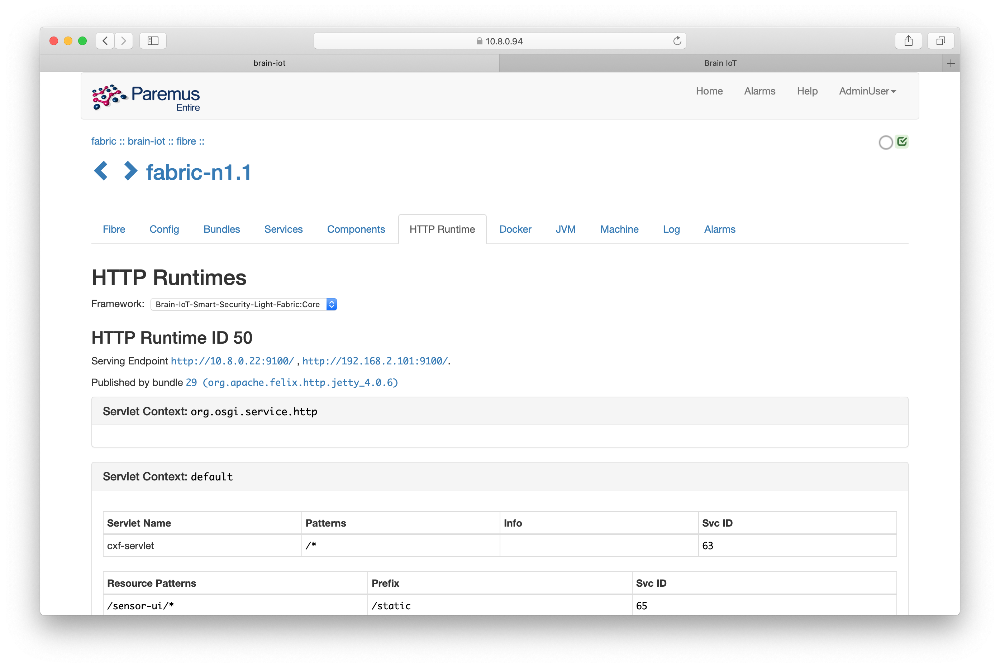{: height="400px"}

## Undeploy

To remove the `system` from the Fabric, click on the `Systems` tab in Fabric Admin and then click the `Security Light` system.

Click the `remove` control (looks like an eject button) and the system will be removed.

## End

That completes this tutorial.


