## Summary

This tutorial shows how to create a Fabric from scratch using Amazon EC2.

The fabric created can then be used for the [Distributed Deployment](20-distributed.html) tutorial.

## Prerequsities

You need an Amazon AWS account with permission to run CloudFormation and provision EC2 instances.

You can not use the AWS free tier because you need to create multiple EC2 instances.
{:.note}

## CloudFormation

Log in to your AWS account and select the region in which you want to create the fabric.

You will be billed for the AWS resources used if you create a stack from this template.
{:.warning}

The approximate cost for a fabric consisting of 1 infrastructure and 3 simple `t3a.small` instances is $0.10/hour.
{:.note}

### Create stack

Navigate to the **CloudFormation** service and click `Create Stack`.

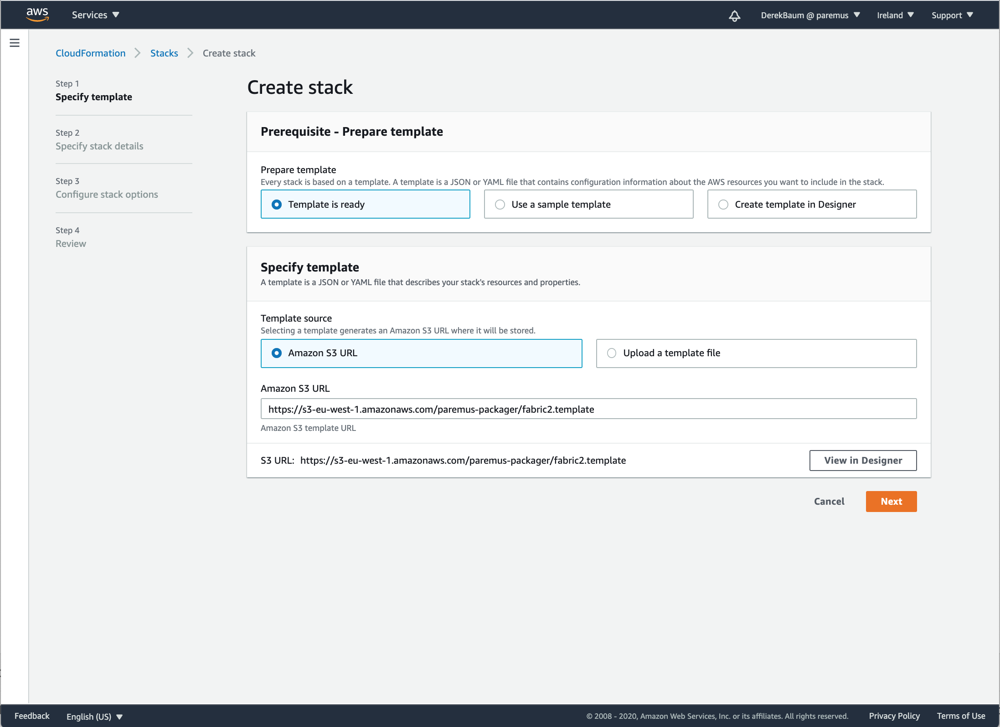{: height="700px"}

Under **Specify template** enter the following for Amazon S3 URL which is an example template:

```
https://s3-eu-west-1.amazonaws.com/paremus-packager/fabric2.template
```

Click `Next`

### Specify stack details

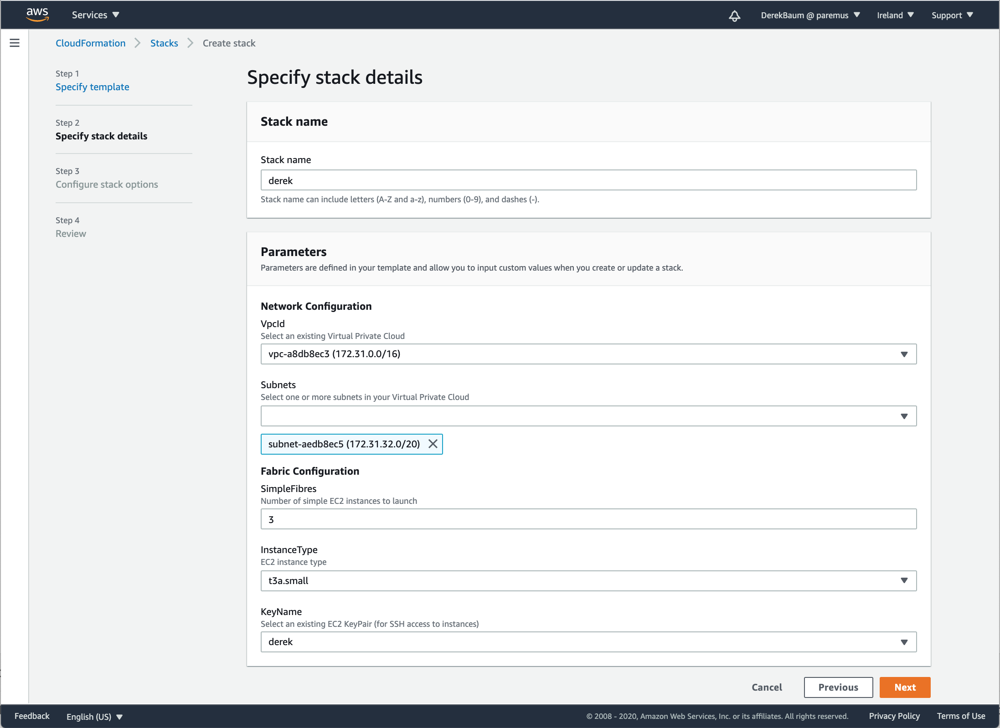{: height="700px"}

Enter a unique stack name

The stack name is also used as the fabric name, and a component of the DNS name for your fabric, so don't just use 'test' or it will conflict with other fabrics using the same name.
{:.note}

Enter your network configuration details by selecting the Vpcid and Subnets.

Choose the number of simple nodes in the fabric.

The fabric is created with 1 infrastructure node and 1-20 simple nodes.
{:.note}

Select the EC2 instance type.

The default instance type `t3a.small` has 2Gb memory and is sufficient for a demo fabric.
{:.note}

Finally select a KeyPair to allow ssh access to the instances.

If you don't have any KeyPairs in this region, you can create one by navigating to [`EC2/Key pairs`](https://docs.aws.amazon.com/AWSCloudFormation/latest/UserGuide/cfn-console-create-keypair.html){:target="_blank"}
{:.note}

Click `Next`

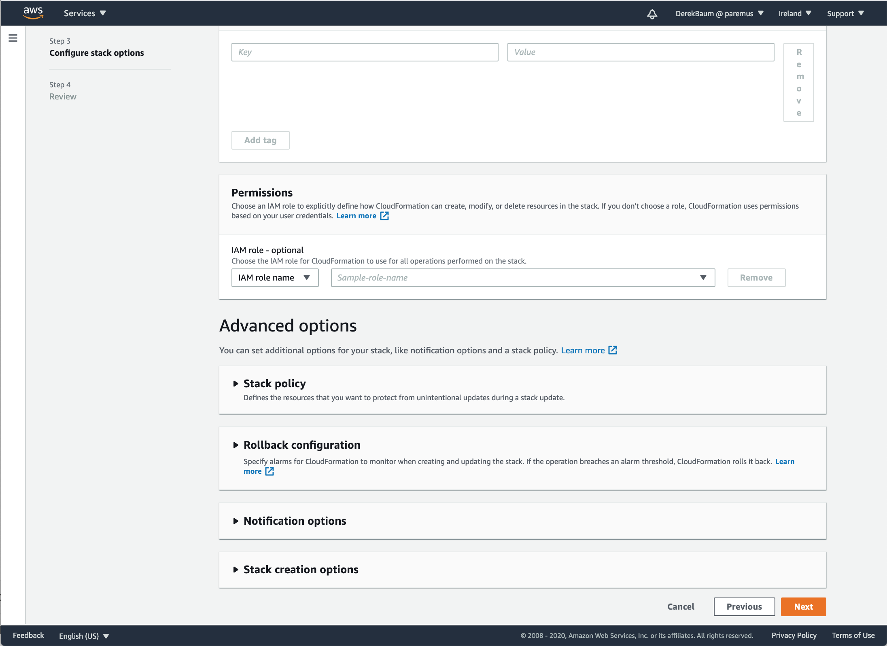{: height="700px"}

Click `Next`

### Review stack

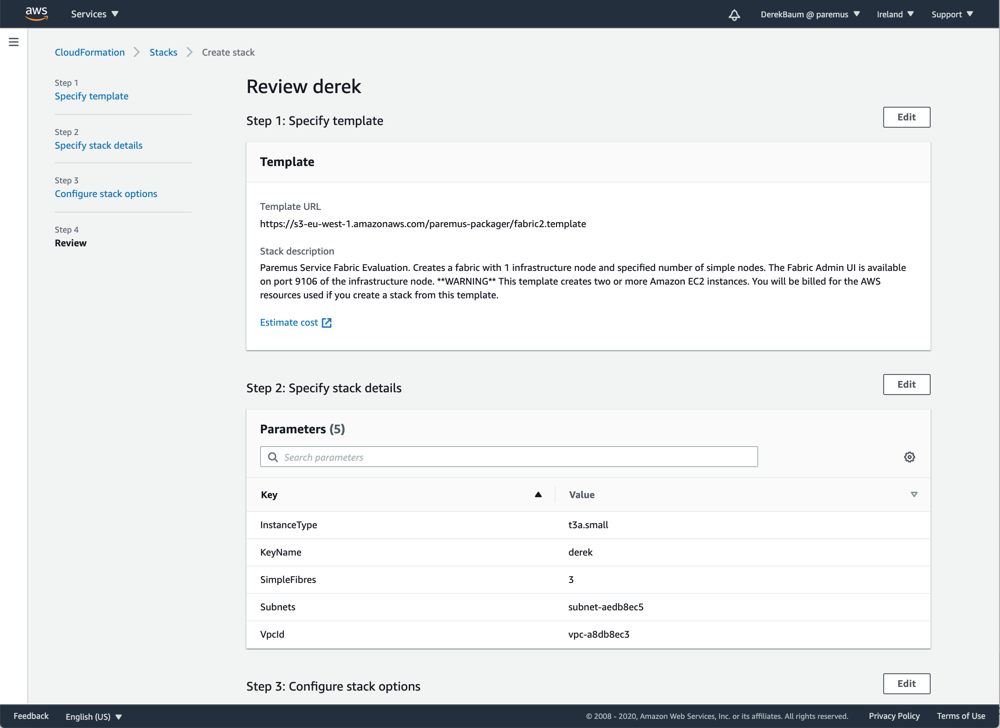{: height="700px"}

scroll to the end:

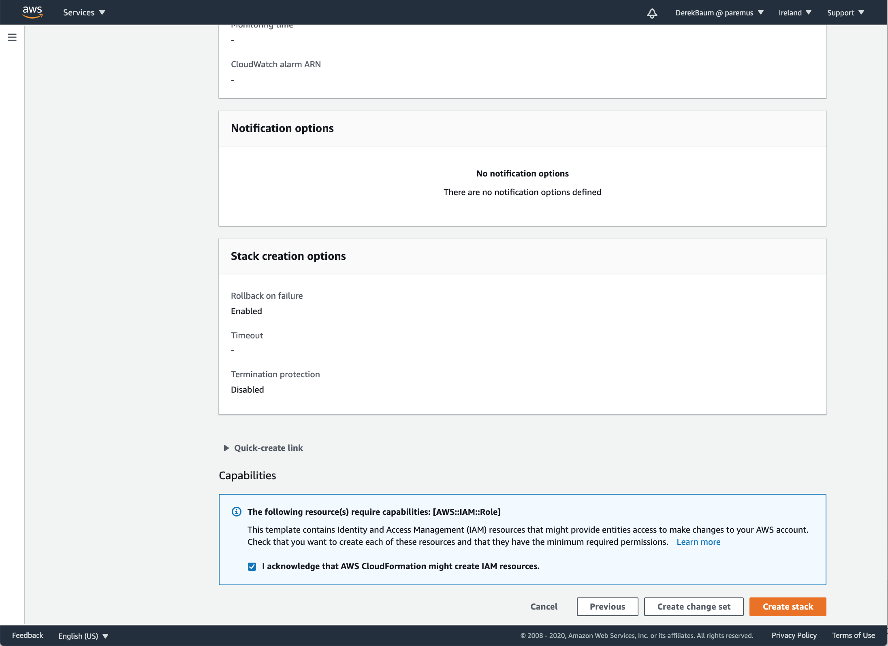{: height="700px"}


Click the checkbox to acknowledge that CloudFormation can create IAM resources.

The fabric template creates an IAM role with permission for `ec2.DescribeInstances` which is needed so fibres can determine the IP address of the infrastructure node.
{:.note}

Click `CreateStack`.

### Create in progress

Stack creation will take about 5 minutes
{:.warning}


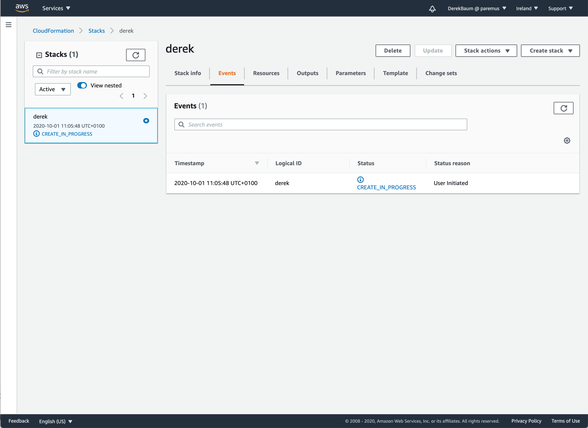{: height="700px"}


You can refresh to see some progress events:

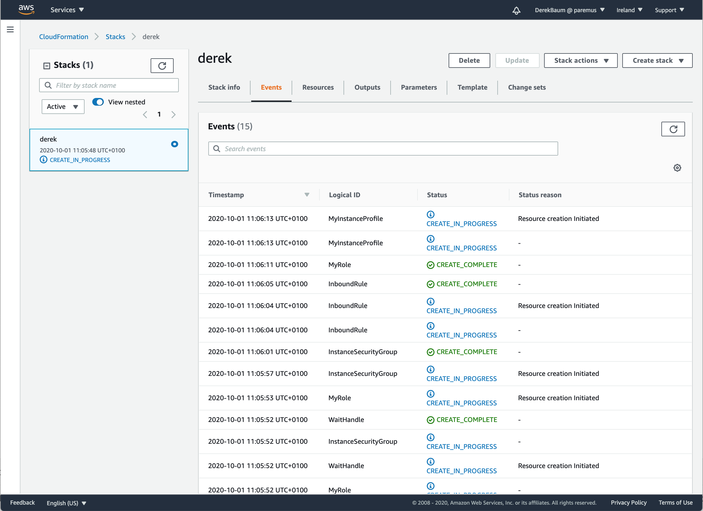{: height="700px"}


If you're bored waiting, after about 2m30s you should see the instances in the EC2 console:

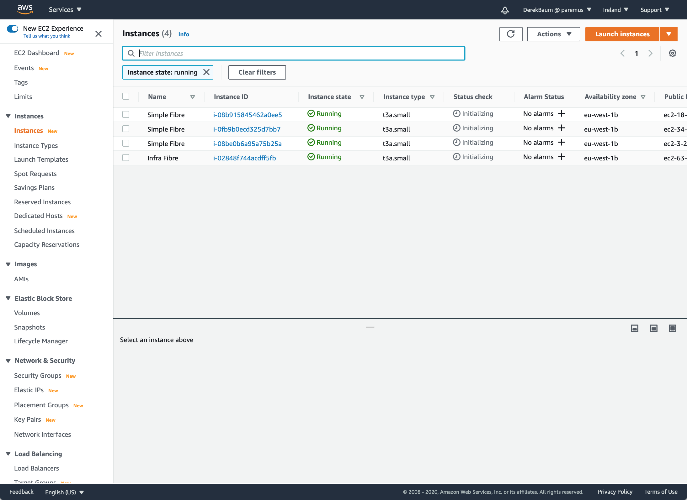{: height="700px"}


### Create complete

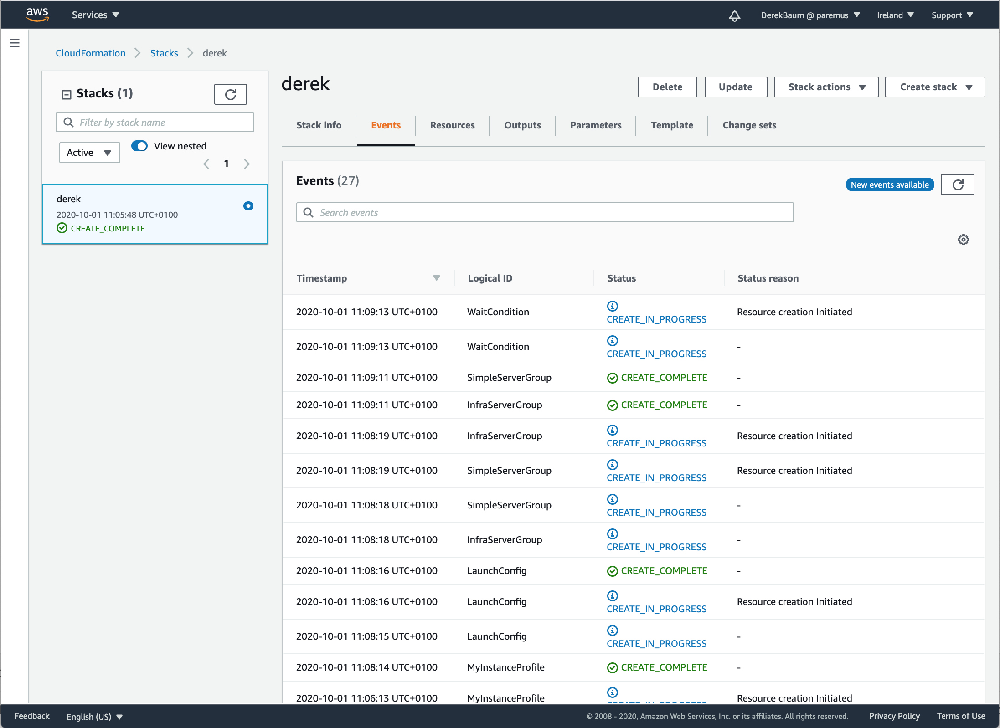{: height="700px"}


When the create is complete, click on the `Outputs` tab and you'll see the URLs for the fabric:

{: height="700px"}


Click on the DNS link and you should see the secure fabric login page:

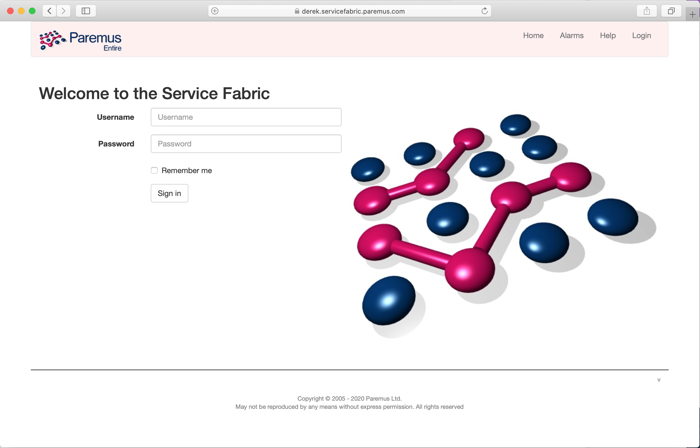{: height="700px"}


This relies on a DNS update to add your fabric IP address as *your-fabric-name*.servicefabric.paremus.com. If the DNS update has not yet propagated to you, use the Fabric IP address instead.
{:.note}

Not using the DNS address will cause a privacy error in the browser, which you need to accept.
{:.warning}

Login to the fabric with Username: `AdminUser` and password: `AdminUser` and check Show: `Fibre Names` and you should see all the fibres in your fabric:

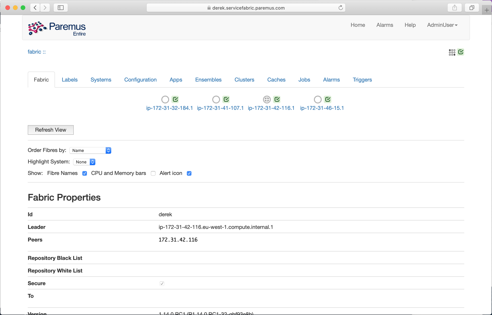{: height="700px"}


## Use Fabric

You can now use this fabric for the [Distributed Deployment](20-distributed.html) tutorial.

The infrastructure node contains **nginx**, which can be used as the webserver for that tutorial

    $ ssh centos@derek.servicefabric.paremus.com
    [centos@ip-172-31-42-116 ~]$ sudo unzip -d /usr/share/nginx/html /tmp/brain-iot-repos-0.0.1-SNAPSHOT.zip
{:.shell}

## Delete stack

When you've finished using the fabric, you should delete the stack to avoid ongoing AWS costs.
{:.warning}

Navigate to CloudFormation, select the stack for your fabric and click `Delete`:

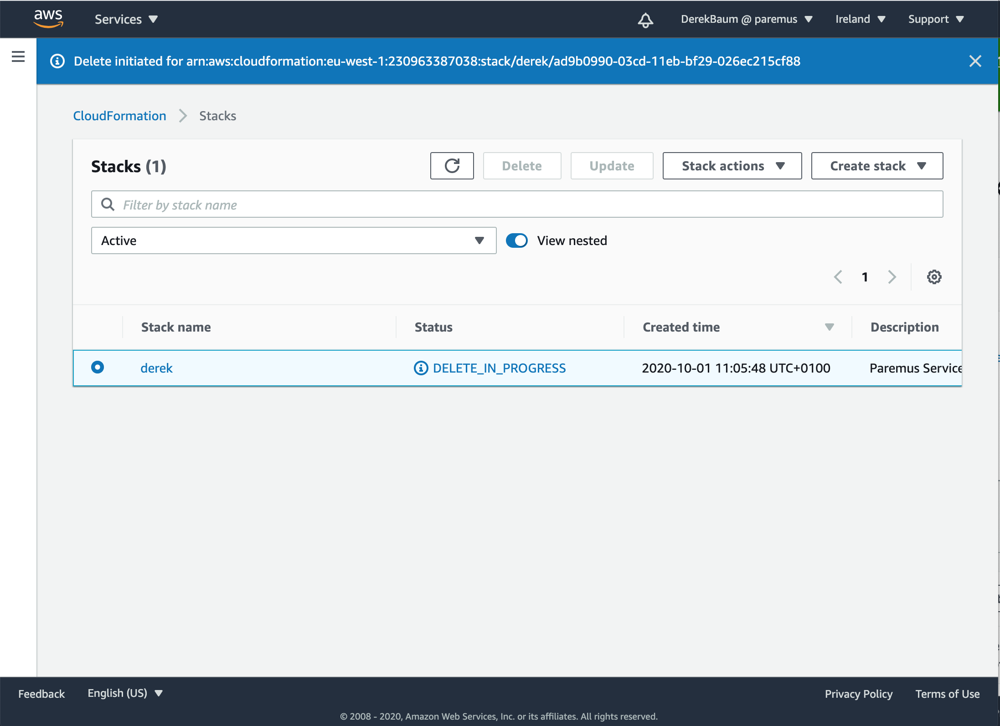{: height="700px"}


## End

That completes this tutorial.
